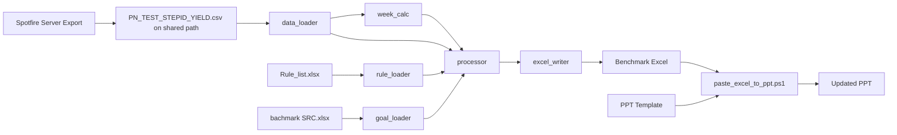

# INAND Weekly Benchmark Generator

把 Spotfire 导出的原始 yield 数据按规则转换成可发布的 weekly benchmark Excel
报表 (一个 product 一个 sheet, 含 Quarter/Month/9 weeks + 上一周 Volume(K))。

## 功能要点

* 读取 Spotfire 导出的 ``PN_TEST_STEPID_YIELD.txt`` 或 ``.csv``。
  若同目录同名同时存在 ``.txt`` 与 ``.csv``，**优先使用 ``.csv``**。
  默认数据源为服务器路径:
  ``\\cvpfilip03\SDSS_MFG_Data\ENG_Data\Tempfile\ADolph\Spotfire_file\PN_TEST_STEPID_YIELD.csv``。
* 校验 ``LT_YIELD ≈ LT_OUTQTY / LT_INQTY/Volume``。
* 从原始数据的 ``WEEK`` + ``FLAG`` + ``STARTTIME``/``ENDTIME`` 列直接挑出
  current week / prev week / 上一月 (M) / 上一季 (Q) - **不重新计算 fiscal calendar**。
* **筛选完全靠 ``Rule_list.xlsx``** (Product 数据筛选 rule + Step 对应 rule),
  程序不在内部写死任何额外过滤条件。每条 family rule (FAMILY/DIEQTY/MTECH/
  Device/STEPID_YIELD) 独立 apply 到原始数据。
* **跨 family 合并展示**: ``Rule_list`` 第一列出现合并单元格表示这几行
  family **共属同一个 product table** (例如 ``Macaw`` 合并了
  ``INAND-MACAW-COMMERCIAL`` 与 ``INAND-MACAW-INDUSTRIAL``;
  ``Swift pro Auto`` = ``INAND-OTHERS`` + 一组 Device 列表), 它们在
  最终 sheet 内**作为一个产品**展示, 不再按 family 分行。具体: 跨 family
  累加 ``LT_INQTY`` / ``LT_OUTQTY``, yield = sum(out)/sum(in), 分组 key =
  ``(MTECH, DIEQTY, STEPID_YIELD)``。
* **Goal / S-Goal 来自 ``bachmark SRC.xlsx``** (每个 sheet = 一个 product
  table; A 列最后一个 token = step code, 含 mtech 信息; B 列 Config; C 列只取
  ``SDSS``; D/E 列 Goal/S-Goal)。匹配方式: 严格 ``(product_table, step,
  dieqty, mtech)`` 精确比较, 找不到 → Goal/S-Goal 留空 + yield 用 **绿底黄字**
  提示。第一列展示文本 (``BICS3 256Gb MTST SA``) 直接复用 SRC A 列, 同 group
  的多个 dieqty 行在 Excel 中**自动 vertical merge**。
* Yield / Goal / S-Goal 单元格统一以 ``0.00%`` 显示, 单元格存储仍是 ``0~1``
  小数 (方便 Excel 内重新排序、参考样式)。
* Volume(K) < 1K 或缺失时, yield 留空，最后一列写 ``No volume``。
* 颜色规则:

  | 条件                                                  | 单元格     |
  | ----------------------------------------------------- | ---------- |
  | Yield > S-Goal                                        | 绿底黑字   |
  | Goal ≤ Yield ≤ S-Goal                                 | 绿底红字   |
  | Yield < Goal 且 Goal-Yield ≤ 1pp                      | 黄底黑字   |
  | Yield < Goal 且 Goal-Yield > 1pp                      | 红底白字   |
  | SRC 中没找到该 step 的 Goal (Goal/S-Goal 留空)        | **绿底黄字** |
* 提供 PyQt6 GUI 与 CLI 两套入口, 后台线程异步生成, 实时日志面板。

## 项目结构

```
benchmark基础/
├── PN_TEST_STEPID_YIELD.txt          # 原始数据 (Spotfire 导出)
├── Rule_list.xlsx                     # 规则文件 (Product+Step)
├── bachmark SRC.xlsx                  # Goal/S-Goal 参考 SRC
├── INAND weekly bachmark.xlsx         # 输出格式参考
├── Screenshot 2026-05-07 004746.jpg   # 颜色规则参考
├── docs/spotfire/
│   ├── EXPORT_CONTRACT.md              # Spotfire 导出契约
│   ├── SPOTFIRE_ANALYSIS_BUILD_GUIDE.md
│   ├── ADMIN_SCHEDULE_REQUEST_TEMPLATE.md
│   └── RUNBOOK_FALLBACK.md
├── pyproject.toml
├── main.py                            # 根目录入口 (调 CLI 或 GUI)
├── src/benchmark/
│   ├── __init__.py
│   ├── data_loader.py                 # 解析 .txt + yield 校验
│   ├── rule_loader.py                 # 解析 Rule_list.xlsx
│   ├── goal_loader.py                 # 解析 bachmark SRC.xlsx -> GoalTable
│   ├── week_calc.py                   # 选 current/prev/month/quarter
│   ├── processor.py                   # 分组合并, 生成 ProductReport
│   ├── excel_writer.py                # 写 .xlsx 并染色
│   ├── cli.py                         # 命令行入口
│   └── gui.py                         # PyQt6 GUI
├── tests/                             # pytest 单元测试 + 真实数据集成测试
├── scripts/
│   ├── validate_spotfire_export.py    # Spotfire 导出文件消费前校验
│   ├── paste_excel_to_ppt.ps1
│   └── run_all_to_ppt.ps1
├── output/                            # 默认输出目录
└── logs/                              # 运行日志
```

## 安装与运行 (Windows, 无管理员权限)

> 你已经装好 [uv](https://github.com/astral-sh/uv); 项目使用 ``uv`` 管理虚拟环境。

```powershell
cd "C:\Users\1000265829\Documents\My_Project\benchmark基础"

uv sync
```

## 常用命令速查

### 日常运行

```powershell
# 打开 GUI
uv run python main.py --gui

# 运行发布版 GUI
dist\INANDBenchmark.exe

# 一键生成 Excel + 更新 PPT + 同步 output 到公共盘
powershell -ExecutionPolicy Bypass -File "scripts/run_all_to_ppt.ps1"

# 只校验 Spotfire 共享 CSV 是否可用
uv run python scripts/validate_spotfire_export.py

# 只用 CLI 生成 Excel
uv run python main.py
```

### 后台自动任务

```powershell
# 注册每周二自动任务
powershell -ExecutionPolicy Bypass -File "scripts/register_tuesday_online_task.ps1"

# 查看任务状态和最近调度日志
powershell -ExecutionPolicy Bypass -File "scripts/manage_tuesday_task.ps1" -Action status

# 查看调度日志和最近一次完整运行日志
powershell -ExecutionPolicy Bypass -File "scripts/manage_tuesday_task.ps1" -Action logs

# 手动触发一次任务
powershell -ExecutionPolicy Bypass -File "scripts/manage_tuesday_task.ps1" -Action run

# 停止当前正在运行的任务实例
powershell -ExecutionPolicy Bypass -File "scripts/manage_tuesday_task.ps1" -Action stop

# 暂停/恢复后续自动触发
powershell -ExecutionPolicy Bypass -File "scripts/manage_tuesday_task.ps1" -Action disable
powershell -ExecutionPolicy Bypass -File "scripts/manage_tuesday_task.ps1" -Action enable

# 彻底删除计划任务
powershell -ExecutionPolicy Bypass -File "scripts/manage_tuesday_task.ps1" -Action unregister
```

### 开发、打包、发布

```powershell
# 运行测试
uv run pytest -q

# 打包 Windows GUI exe
powershell -ExecutionPolicy Bypass -File "scripts/build_windows_exe.ps1"

# 查看 Git 状态
git status --short --branch

# 提交并推送当前改动
git add README.md RELEASE.md scripts src
git commit -m "Update benchmark automation workflow"
git push
```

默认共享路径：

```text
数据源: \\cvpfilip03\SDSS_MFG_Data\ENG_Data\Tempfile\ADolph\Spotfire_file\PN_TEST_STEPID_YIELD.csv
公共输出: \\cvpfilip03\SDSS_MFG_Data\ENG_Data\Tempfile\ADolph\Spotfire_file\output
```

## 项目逻辑总览



核心原则:

* 数据源优先级: 同名 ``.csv`` 优先于 ``.txt``。
* 默认消费 Spotfire 服务器每周二生成的共享 CSV。
* Fiscal period 不自行计算日历, 只使用数据源中 ``WEEK`` / ``FLAG`` / ``STARTTIME`` / ``ENDTIME``。
* 产品筛选只依据 ``Rule_list.xlsx``。
* Goal/S-Goal 只来自 ``bachmark SRC.xlsx`` 或在未提供 SRC 时回退原始数据。
* Excel 与 PPT 功能解耦: 可单独生成 Excel, 也可单独更新 PPT。

## 项目规划

* 短期: 稳定 Spotfire 定期导出, 使用 ``scripts/validate_spotfire_export.py`` 做消费前校验。
* 中期: 由 Spotfire 管理员接入 Automation Services 调度, 减少手工导出。
* 长期: 将 Team 发布流程标准化, 每次 release 附带 exe、README、Spotfire 运维文档与测试结果。

### CLI 一键生成

```powershell
uv run python main.py --today 2026-05-07 -v
```

### 一键生成并贴到 PPT（实时日期）

```powershell
powershell -ExecutionPolicy Bypass -File "scripts/run_all_to_ppt.ps1"
```

说明:
* 默认读取服务器共享 CSV:
  ``\\cvpfilip03\SDSS_MFG_Data\ENG_Data\Tempfile\ADolph\Spotfire_file\PN_TEST_STEPID_YIELD.csv``。
* 该命令不传 ``--today``，默认使用电脑当前日期/时间（实时）。
* 先执行 Spotfire 导出契约校验（文件时效/行数/关键列），通过后才继续。
* 会先生成 Excel，再按 ``Rule_list.xlsx`` 第三个 sheet(``Sheet1``) 的顺序/页码，
  把各产品表粘贴到 ``SDSS INAND YIELD WW45_2026_benchmark.pptx``。
* PPT 不再直接覆盖模板；会按本次报告所属的上一周 ``prev_week`` 自动另存到 ``output``，
  例如当前周为 ``2026FW52`` 时，报告名为 ``output\SDSS INAND YIELD WW51_2026_benchmark.pptx``。
* PPT 内部所有 ``Wxx'yy`` 周别文字也会同步替换为报告周别，例如 ``W51'26``。
* 流程结束后会把本地 ``output`` 目录同步复制到公共盘:
  ``\\cvpfilip03\SDSS_MFG_Data\ENG_Data\Tempfile\ADolph\Spotfire_file\output``。
* 粘贴位置固定: 距离左边 ``0.2"``、距离上边 ``1.5"``。

### 仅执行 Spotfire 导出校验

```powershell
uv run python scripts/validate_spotfire_export.py
```

可选参数:
* ``--max-age-hours`` 导出文件最大时效（默认 ``36``）
* ``--min-rows`` 最小行数门槛（默认 ``100``）

参数:

* ``--data``         原始数据 `.txt/.csv` 路径, 默认服务器共享 CSV。
                     若同名 `.csv` 存在会自动优先选 `.csv`
* ``--rules``        规则 .xlsx 路径, 默认 ``Rule_list.xlsx``
* ``--src-goals``    Goal/S-Goal SRC 路径, 默认 ``bachmark SRC.xlsx``;
                     传空字符串 ``--src-goals ""`` 则不使用, 退回原始数据 Goal
* ``--output``       输出 .xlsx 路径, 默认 ``output/INAND_weekly_benchmark.xlsx``
* ``--today``        指定 ``YYYY-MM-DD``, 默认本机当前时间
* ``--weeks``        Window 大小 (默认 9)
* ``--log-file``     日志文件 (默认 ``logs/run.log``)
* ``-v``             打印 DEBUG 级别日志

### GUI

```powershell
uv run python main.py --gui
```

或直接运行发布版可执行文件:

```powershell
dist\INANDBenchmark.exe
```

GUI 提供:

* 文件选择器 (原始数据 / 规则 / 输出)
* 日期切换 (使用电脑当前日期 / 自定义)
* **Excel 与 PPT 分区操作**:
  * ``生成 Excel``: 仅更新报表 Excel
  * ``更新 PPT``: 仅把指定 Excel 粘贴到指定 PPT (自动删除旧表后重贴)
  * ``一键 Excel + PPT``: 串行执行两步，按报告所属上一周自动另存 PPT，并同步周别文字
* ``最近一次运行结果`` 面板: 显示最后任务类型、运行时间、最新 Excel/PPT 路径与状态
* 实时滚动的运行日志
* 完成后弹出摘要并能"打开输出目录"

### 每周二自动运行（当前用户，无管理员权限）

项目提供一个计划任务注册脚本：

```powershell
powershell -ExecutionPolicy Bypass -File "scripts/register_tuesday_online_task.ps1"
```

注册后会创建当前用户任务 ``INAND Benchmark Tuesday Online``：

* 这是 Windows Task Scheduler 后台任务，不依赖 Cursor 或注册时的 PowerShell 窗口。
* 平时不常驻运行，只在触发时间启动短任务；检查不满足条件时会立即退出，资源占用很低。
* 每周二 06:00 开始每 30 分钟尝试一次，持续一天。
* 公司域策略通常会禁止“用户登录时”触发任务；因此不使用登录触发，改用周二定时轮询。
* 脚本会先检查今天是否周二、共享 CSV 是否可访问。
* 一旦本 ISO 周成功运行，会写入本地 stamp 文件，本周后续触发会自动跳过。
* 日志位置:
  ``%LOCALAPPDATA%\INANDBenchmark\scheduled_run.log``。

管理命令：

```powershell
# 查看任务状态 + 最近调度日志
powershell -ExecutionPolicy Bypass -File "scripts/manage_tuesday_task.ps1" -Action status

# 查看调度日志和最近一次完整运行日志
powershell -ExecutionPolicy Bypass -File "scripts/manage_tuesday_task.ps1" -Action logs

# 手动触发一次任务
powershell -ExecutionPolicy Bypass -File "scripts/manage_tuesday_task.ps1" -Action run

# 停止当前正在运行的任务实例
powershell -ExecutionPolicy Bypass -File "scripts/manage_tuesday_task.ps1" -Action stop

# 暂停/恢复后续自动触发
powershell -ExecutionPolicy Bypass -File "scripts/manage_tuesday_task.ps1" -Action disable
powershell -ExecutionPolicy Bypass -File "scripts/manage_tuesday_task.ps1" -Action enable

# 彻底删除计划任务
powershell -ExecutionPolicy Bypass -File "scripts/manage_tuesday_task.ps1" -Action unregister
```

### 参考文件是否需要搬到服务器

不强制。默认逻辑是：

* ``PN_TEST_STEPID_YIELD.csv`` 从 Spotfire 服务器共享路径读取。
* ``Rule_list.xlsx``、``bachmark SRC.xlsx``、PPT 模板默认仍从项目目录读取。

建议：

* 只有你本机使用：参考文件放项目目录即可。
* Team 多人共用：建议把 ``Rule_list.xlsx``、``bachmark SRC.xlsx`` 和 PPT 模板也放到共享目录，运行时在 GUI/CLI 参数中指向共享路径，避免每台电脑规则版本不一致。
* 如果规则或目标值经常调整，优先共享参考文件；如果它们相对稳定，可以随 release 包一起分发。

### Spotfire 运维文档

* [`docs/spotfire/EXPORT_CONTRACT.md`](docs/spotfire/EXPORT_CONTRACT.md)
* [`docs/spotfire/SPOTFIRE_ANALYSIS_BUILD_GUIDE.md`](docs/spotfire/SPOTFIRE_ANALYSIS_BUILD_GUIDE.md)
* [`docs/spotfire/ADMIN_SCHEDULE_REQUEST_TEMPLATE.md`](docs/spotfire/ADMIN_SCHEDULE_REQUEST_TEMPLATE.md)
* [`docs/spotfire/RUNBOOK_FALLBACK.md`](docs/spotfire/RUNBOOK_FALLBACK.md)

## 发布与打包

### 打包 GUI exe

```powershell
powershell -ExecutionPolicy Bypass -File "scripts/build_windows_exe.ps1"
```

生成文件:

```text
dist\INANDBenchmark.exe
```

### Release 校验建议

```powershell
uv run pytest -q
uv run python scripts/validate_spotfire_export.py --data "PN_TEST_STEPID_YIELD.txt" --max-age-hours 9999 --min-rows 100
```

### Git 发布

当前项目可纳入 Git 管理。建议发布前确认:

```powershell
git status
git remote -v
```

若目录尚未初始化 Git, 需要先执行 ``git init`` 并配置远端仓库后再提交/推送。

## 测试

```powershell
uv run pytest             # 一键跑全量测试 (单元 + 真实数据集成)
uv run pytest -v -k week  # 只跑某一类
uv run pytest tests/test_data_loader.py::test_validate_yield_passes -x
```

测试涵盖:

| 文件                                  | 覆盖                                                     |
| ------------------------------------- | -------------------------------------------------------- |
| ``tests/test_data_loader.py``         | 加载 + 编码自动识别 + yield 校验                          |
| ``tests/test_rule_loader.py``         | Product 规则合并 (Macaw 4 family) + 步骤代码 + ``&`` 分隔 |
| ``tests/test_goal_loader.py``         | SRC 解析 + 合并单元格 + 仅取 SDSS + mtech 模糊匹配         |
| ``tests/test_week_calc.py``           | 当前周/上周/上月/上季的选择                              |
| ``tests/test_processor_and_excel.py`` | 颜色规则 (含绿底黄字) + Volume 阈值 + 端到端真实数据      |

## 调试指南

### 1. 用 ``-v`` 看每一步发生了什么

```powershell
uv run python main.py --today 2026-05-07 -v
```

日志会按时间打印:

```
... | INFO | Loading raw data: PN_TEST_STEPID_YIELD.txt
... | INFO | Loaded 40872 rows, columns: 32
... | INFO | LT_YIELD 校验通过 (容差 1e-3)
... | INFO | Loaded 9 product rule(s)
... | INFO | Periods: current=2026FW45 prev=2026FW44 month=2026M04 quarter=2026FQ3 weeks=(...)
... | INFO | Built 9 product reports
... | INFO |   - condor                 rows=27
...
```

如果某一步异常, 异常 traceback 与中间 dataframe 的列、行数都会出现, 帮助快速定位。

### 2. 在 IDE/Cursor 里设置断点调试

* CLI: 在 ``src/benchmark/cli.py:run`` 打断点; 启动 ``python main.py``。
* GUI: 在 ``src/benchmark/gui.py`` 的 ``_TaskWorker.run`` 打断点 (生成发生在子线程,
  请确保 IDE 支持子线程断点)。
* 数据流: ``data_loader.load_yield_data`` → ``week_calc.select_periods`` →
  ``processor.build_all_reports`` → ``excel_writer.write_excel``。

### 3. 单测重现 bug

发现某个 product 输出不对时, 推荐做法:

```powershell
uv run python -c "from benchmark.data_loader import load_yield_data; df=load_yield_data('PN_TEST_STEPID_YIELD.txt'); print(df.query(\"FAMILY=='INAND-MACAW-COMMERCIAL' and FLAG=='W' and WEEK=='2026FW44'\")[['DIEQTY','STEPID_YIELD','LT_INQTY/Volume','LT_OUTQTY','LT_YIELD']].head())"
```

或者新增一条测试用例固定 bug, 确保后续不再回归。

### 4. 查看真实输出 + 颜色统计

```powershell
uv run python main.py --today 2026-05-07
start output\INAND_weekly_benchmark.xlsx
```

如果只想看每个 sheet 多少行 + 颜色分布:

```powershell
uv run python -c "
import openpyxl
wb=openpyxl.load_workbook('output/INAND_weekly_benchmark.xlsx')
for s in wb.sheetnames:
    ws=wb[s]; n={'GREEN':0,'YELLOW':0,'RED':0}
    for r in ws.iter_rows(min_row=2):
        for c in r:
            fg=c.fill.fgColor.rgb if c.fill and c.fill.fgColor else None
            if fg=='FF92D050': n['GREEN']+=1
            elif fg=='FFFFFF00': n['YELLOW']+=1
            elif fg=='FFFF0000': n['RED']+=1
    print(f'{s:20s} rows={ws.max_row-1:3d} {n}')
"
```

## 规则字段约定

* ``Rule_list.xlsx`` 多值字段(``DIEQTY`` / ``MTECH`` / ``Device`` / ``STEPID_YIELD``)
  支持 ``,``、``&``、``;`` 或换行作为分隔符 (例如 Macaw 规则里 ``7215&7010``)。
  ``All`` 或留空表示不过滤。
* ``bachmark SRC.xlsx`` 中:
  * **sheet 名 = product table 名** (与 Rule_list 的 ``Product table name`` 大小写/空格不敏感匹配)。
    Sheet ``Sapota`` / ``Oberon`` 在 Rule_list 中没有对应 product, 仅作为 Goal 库存在,
    不会出现在最终 Excel 里。
  * **A 列**: 合并单元格, 最后一个空格分隔的 token 是 step code (``SU``/``SK``/``SB``/``S9``/...);
    程序在 A 列里再用正则 ``\d+(?:Gb|Tb)`` 提取 mtech (``64Gb``/``256Gb``/``512Tb``...)。
  * **C 列 Assy** 只取 ``SDSS``。
  * 查表规则: 按 ``(product_table, step_code, dieqty, mtech)`` 匹配;
    匹配不到 → missing (绿底黄字)。
  * mtech 单位归一规则: ``Tb`` 与 ``Gb`` 按容量等价换算后再比较
    (例如 ``1Tb == 1024Gb``)；``512Tb`` 与 ``512Gb`` 这种容量不同的值仍视为不匹配。
  * step code 兼容规则: 若原始 step 含后缀（例如 ``SV_-25C``），会先尝试全值匹配，
    再尝试前缀匹配（``SV``）以适配 SRC 中的简写 step。
  * 入参 mtech 为空时 (极少, 原始数据 ``MTECH`` 列空白), 退到 SRC 中无 mtech
    标注的 entry, 否则取该 (step, die) 的第一条。
* 原始数据 ``GOAL_BEFORE`` / ``YIELD_TARGET`` 仅在 **未提供 ``--src-goals``** 时作 fallback;
  即使其中出现 ``Goal > S-Goal`` 的脏数据, 程序按颜色规则照常处理, 不强制纠正。
